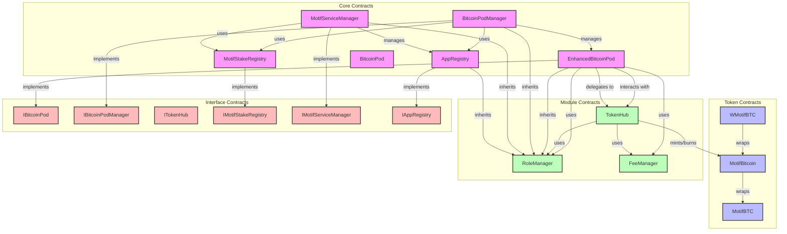

# Motif Core Contracts Architecture

This document provides a visual representation of the Motif Core Contracts architecture and its component relationships.

## System Architecture Diagram

## Component Descriptions

### Core Contracts
- **EnhancedBitcoinPod**: Main contract for Bitcoin custody and token management
- **BitcoinPodManager**: Manages multiple Bitcoin pods
- **MotifServiceManager**: Handles service management and registration
- **MotifStakeRegistry**: Manages staking functionality
- **AppRegistry**: Handles application registration and management
- **BitcoinPod**: Base contract for Bitcoin pod functionality

### Token Contracts
- **MotifBitcoin**: Main token contract
- **WMotifBTC**: Wrapped version of MotifBitcoin
- **MotifBTC**: Base token implementation

### Module Contracts
- **RoleManager**: Handles role-based access control
- **TokenHub**: Manages token minting and burning
- **FeeManager**: Handles fee calculations and distribution

### Interface Contracts
- Define the contract interfaces for all major components
- Ensure consistent interaction patterns

## Key Relationships

1. **EnhancedBitcoinPod**
   - Implements IBitcoinPod interface
   - Uses FeeManager for fee handling
   - Uses RoleManager for access control
   - Interacts with TokenHub for token operations

2. **BitcoinPodManager**
   - Manages multiple EnhancedBitcoinPod instances
   - Uses MotifStakeRegistry for staking functionality
   - Uses AppRegistry for application management

3. **TokenHub**
   - Handles token minting and burning operations
   - Uses both RoleManager and FeeManager
   - Interacts with the MotifBitcoin token contract

4. **Token System**
   - MotifBitcoin is the main token
   - WMotifBTC provides wrapped functionality
   - Both are managed through the TokenHub

## System Features

The architecture provides a robust system for:
- Bitcoin custody and management
- Token minting and burning
- Role-based access control
- Fee management
- Service and application management
- Staking functionality

The system is designed to be modular, with clear separation of concerns and well-defined interfaces between components. 