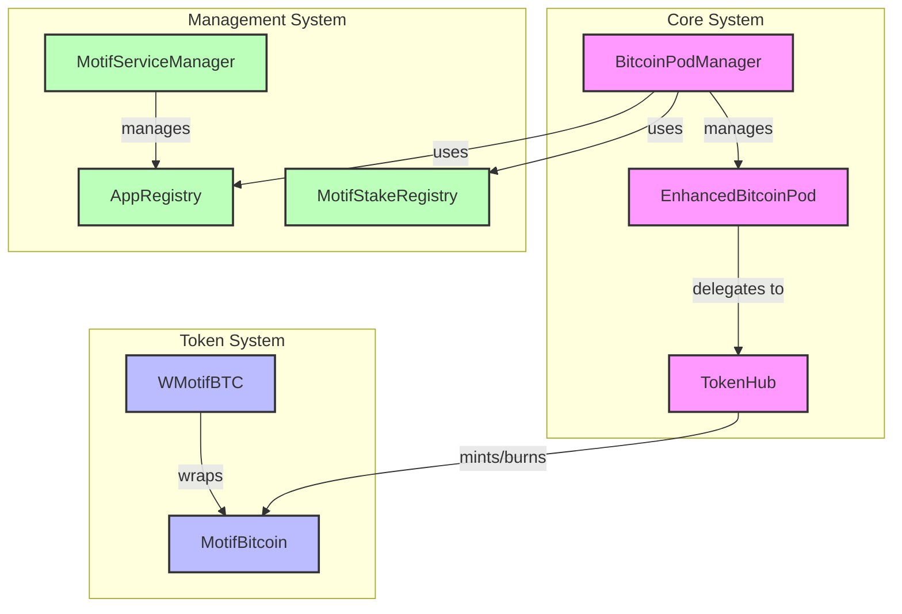

# Motif Core Contracts - High Level Overview

This document provides a simplified high-level overview of the Motif Core Contracts architecture.

## System Overview Diagram

## System Components

### Core System
- **EnhancedBitcoinPod**: Main contract for Bitcoin custody
- **BitcoinPodManager**: Manages multiple Bitcoin pods
- **TokenHub**: Handles token operations

### Token System
- **MotifBitcoin**: Main token contract
- **WMotifBTC**: Wrapped version for DeFi compatibility

### Management System
- **MotifServiceManager**: Service management
- **MotifStakeRegistry**: Staking functionality
- **AppRegistry**: Application management

## Key Interactions
1. Bitcoin Pods are managed by the Pod Manager
2. Pods delegate token operations to the Token Hub
3. Token Hub handles minting and burning of MotifBitcoin
4. Management system handles services, staking, and applications 