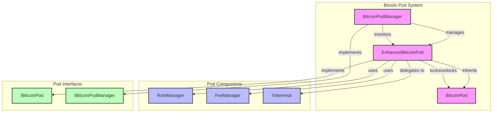

# Bitcoin Pod System Architecture

This document provides a detailed view of the Bitcoin Pod system architecture.

## Bitcoin Pod System Diagram

## Component Details

### Core Pod Components
- **EnhancedBitcoinPod**: Advanced Bitcoin custody contract with token management
- **BitcoinPod**: Base contract with core Bitcoin custody functionality
- **BitcoinPodManager**: Manages multiple pod instances

### Supporting Components
- **RoleManager**: Handles access control and permissions
- **FeeManager**: Manages fee calculations and distribution
- **TokenHub**: Handles token operations and delegation

### Interfaces
- **IBitcoinPod**: Defines pod functionality interface
- **IBitcoinPodManager**: Defines pod manager functionality interface

## Key Features

### Pod Management
- Pod creation and initialization
- Pod state management (active, locked, etc.)
- Pod monitoring and maintenance

### Access Control
- Role-based permissions
- Multi-signature support
- Operator management

### Fee Management
- Fee calculation
- Fee distribution
- Fee accrual

### Token Operations
- Token delegation
- Token minting/burning
- Balance tracking 