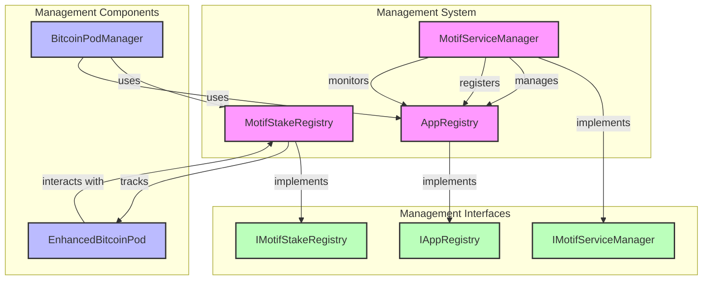

# Management System Architecture

This document provides a detailed view of the Management system architecture.

## Management System Diagram

## Component Details

### Core Management Components
- **MotifServiceManager**: Manages service registration and monitoring
- **MotifStakeRegistry**: Handles staking functionality and tracking
- **AppRegistry**: Manages application registration and access

### Supporting Components
- **BitcoinPodManager**: Integrates with management system
- **EnhancedBitcoinPod**: Interacts with staking registry

### Interfaces
- **IMotifServiceManager**: Defines service management interface
- **IMotifStakeRegistry**: Defines staking registry interface
- **IAppRegistry**: Defines application registry interface

## Key Features

### Service Management
- Service registration
- Service monitoring
- Service access control

### Staking Management
- Stake tracking
- Stake rewards
- Stake validation

### Application Management
- Application registration
- Application access control
- Application monitoring

### System Integration
- Pod manager integration
- Service coordination
- Registry synchronization 