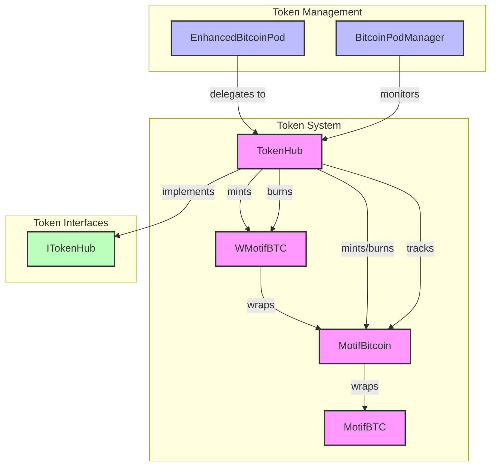

# Token System Architecture

This document provides a detailed view of the Token system architecture.

## Token System Diagram

## Component Details

### Core Token Components
- **MotifBitcoin**: Main token contract for Bitcoin representation
- **WMotifBTC**: Wrapped version for DeFi compatibility
- **MotifBTC**: Base token implementation
- **TokenHub**: Central token management contract

### Management Components
- **EnhancedBitcoinPod**: Delegates token operations
- **BitcoinPodManager**: Monitors token operations

### Interfaces
- **ITokenHub**: Defines token hub functionality interface

## Key Features

### Token Operations
- Token minting and burning
- Token wrapping and unwrapping
- Balance tracking and management

### Token Management
- Token delegation
- Token custody
- Token transfers

### DeFi Integration
- Wrapped token support
- DeFi protocol compatibility
- Liquidity management

### Security Features
- Access control
- Transaction validation
- Balance verification 